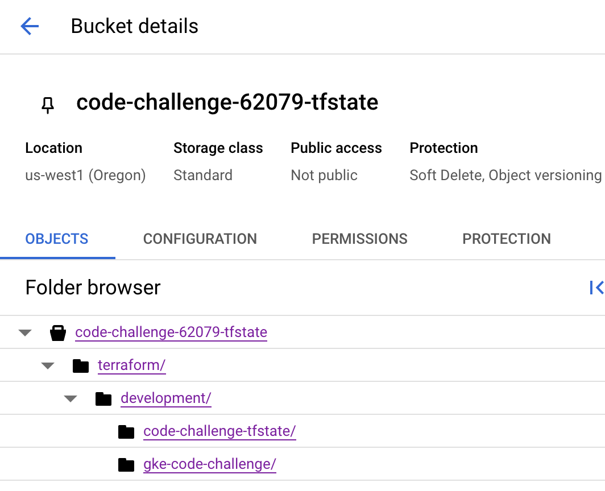
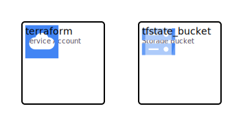

# code-challenge-tfstate

This repo creates the GCS backend to manage Terraform remote state. The bucket has versioning enabled, and has state locking enabled by default.

## Deployment

This is a chicken/egg issue with a remote-state backend. The bucket needs to be created/existing before Terraform can store it's state. I recommend commenting out the `backend.tf` config, then manually running Terraform commands to create the bucket. 

Then, once the bucket is created, uncomment out `backend.tf` and update the `bucket` attribute with the newly minted GCS bucket name.

Then, manually run a `init` command and say `yes` to copy the existing state.

```bash
terraform init -backend-config='prefix=terraform/development/code-challenge-tfstate/'
Initializing the backend...
Do you want to copy existing state to the new backend?
  Pre-existing state was found while migrating the previous "local" backend to the
  newly configured "gcs" backend. No existing state was found in the newly
  configured "gcs" backend. Do you want to copy this state to the new "gcs"
  backend? Enter "yes" to copy and "no" to start with an empty state.

  Enter a value: yes
```

## Python wrapper

The above deploy steps are a "run once", and now that the bucket exists, and state has been migrated to it, the provided `wrapper.py` script can be leveraged to run future Terraform commands. ie

```bash
python wrapper.py init --var_file=development.tfvars --gcloud_env=development --project_name=code-challenge-tfstate

python wrapper.py plan --var_file=development.tfvars --gcloud_env=development --project_name=code-challenge-tfstate

python wrapper.py apply --var_file=development.tfvars --gcloud_env=development --project_name=code-challenge-tfstate
```

If everything comes together, a typical folder structure with multiple projects would look like the following.


<div align=center>

</div>

<!-- BEGIN_TF_DOCS -->
# Terraform

## Providers

| Name | Version |
|------|---------|
| <a name="provider_google"></a> [google](#provider\_google) | 6.5.0 |

## Inputs

| Name | Description | Type | Default | Required |
|------|-------------|------|---------|:--------:|
| <a name="input_project_id"></a> [project\_id](#input\_project\_id) | Default gcloud project to launch this cluster into | `string` | n/a | yes |
| <a name="input_region"></a> [region](#input\_region) | Default region | `string` | `"us-central1"` | no |
| <a name="input_service_account_name"></a> [service\_account\_name](#input\_service\_account\_name) | gcloud service account name to use. | `string` | `"terraform"` | no |
| <a name="input_skip_service_account_creation"></a> [skip\_service\_account\_creation](#input\_skip\_service\_account\_creation) | Ignore creating new service account if the name already exists. | `bool` | `true` | no |

## Outputs

| Name | Description |
|------|-------------|
| <a name="output_gcs_bucket_name"></a> [gcs\_bucket\_name](#output\_gcs\_bucket\_name) | n/a |
<!-- END_TF_DOCS -->

## Diagram

<div align=center>

</div>
